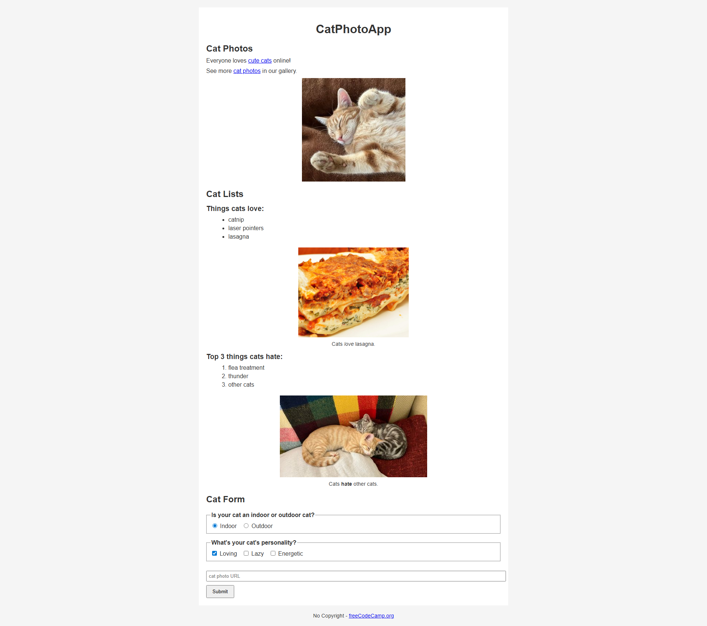

# Cat Photo App

A beginner-friendly project built with **HTML5** and **CSS3**. This project is part of my front-end development learning journey, inspired by the FreeCodeCamp curriculum.  

🔗 [Live Demo](https://josephvyse.github.io/frontend-exercises/01-cat-photo-app/)

---

## 📌 Features
- Basic HTML structure with **semantic elements** (`<section>`, `<figure>`, `<form>`, `<footer>`).  
- Cat photo gallery with images, captions, and links.  
- Ordered and unordered lists for “things cats love” and “things cats hate.”  
- Interactive form with radio buttons, checkboxes, text input, and submit button.  
- Responsive layout with a clean, simple CSS design.  

---

## 🛠 Technologies Used
- HTML5  
- CSS3  

---

## 📷 Screenshot
  
*(Add a file named `screenshot.png` in this folder to display it here.)*  

---

## 🎯 Lessons Learned
- How to structure a page with **headings, sections, and forms**.  
- Embedding and styling images with `<figure>` and `<figcaption>`.  
- Using **radio buttons, checkboxes, and form inputs** for interactivity.  
- Applying CSS for **typography, spacing, and responsive layouts**.  

---

