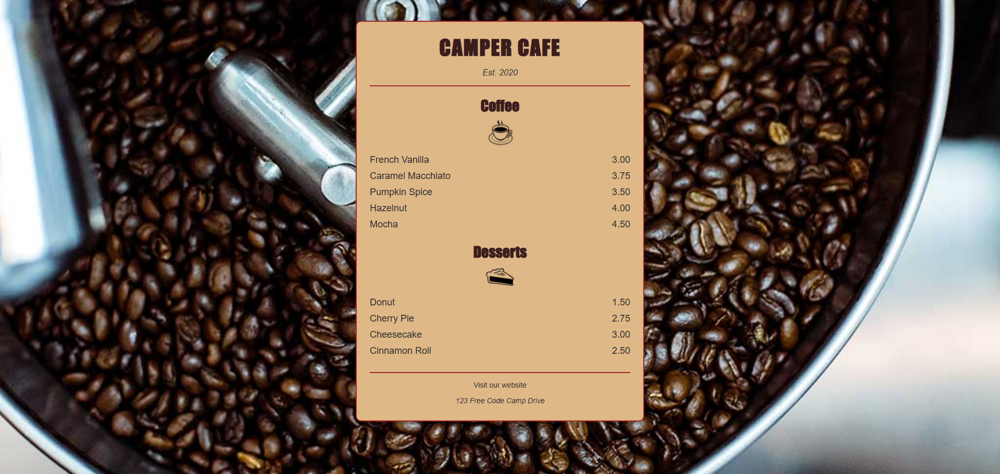

# Cafe Menu ☕  

A styled **Cafe Menu webpage** built with **HTML5** and **CSS3**. This project is part of my front-end development practice, inspired by the FreeCodeCamp curriculum.  

🔗 [Live Demo](https://josephvyse.github.io/frontend-exercises/02-cafe-menu/)  

---

## 📌 Features
- Background image with fixed attachment for a stylish cafe feel.  
- Semantic HTML structure (`<header>`, `<main>`, `<section>`, `<footer>`).  
- Organized menu items using `<article>` blocks for coffee and desserts.  
- CSS styling with:  
  - Custom typography (Impact + sans-serif fallback).  
  - Responsive, centered layout with **max-width** for readability.  
  - Styled borders, rounded corners, and drop shadows for a modern look.  
- Footer with address and external link to FreeCodeCamp.  

---

## 🛠 Technologies Used
- HTML5  
- CSS3  

---

## 📷 Screenshot
   

---

## 🎯 Lessons Learned
- How to apply **background images** with `background-size: cover` and `background-attachment: fixed`.  
- Using **semantic HTML elements** (`<section>`, `<article>`) for better structure.  
- Applying **box shadows, borders, and rounded corners** for styling.  
- Organizing inline elements (`flavor`, `dessert`, `price`) using **inline-block CSS** for layout.  
- Improving readability with **max-width containers** and consistent spacing.  

---
