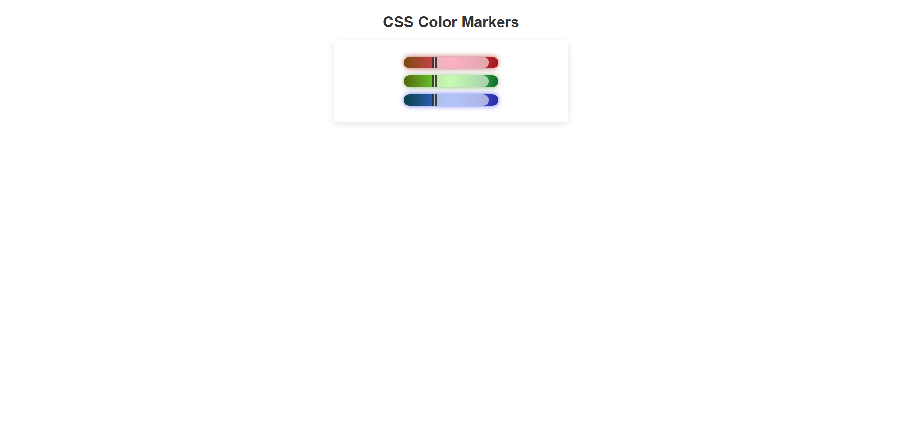

# CSS Colored Markers 🖊️  

A simple project built with **HTML5** and **CSS3** that creates three colored markers (red, green, and blue) using gradients and shadows. This exercise is part of my front-end development practice, inspired by the FreeCodeCamp curriculum.  

🔗 [Live Demo](https://josephvyse.github.io/frontend-exercises/03-colored-markers)  

---

## 📌 Features
- Structured HTML with a container and marker elements.  
- **CSS gradients** applied to create realistic marker colors.  
- **Box shadows** for glowing effects around each marker.  
- Separate **cap** and **sleeve** styling to mimic a real marker.  
- Clean, centered layout with subtle container styling.  

---

## 🛠 Technologies Used
- HTML5  
- CSS3 (gradients, shadows, flexbox, borders, RGBA & HSL colors) 

---

## 📷 Screenshot
  

---

## 🎯 Lessons Learned
- How to use **linear gradients** to simulate realistic colors.  
- Applying **box shadows** for glowing visual effects.  
- Using **flexbox** to align and structure elements.  
- Styling with **HSL, RGB, and RGBA** for flexible color control.  

---
