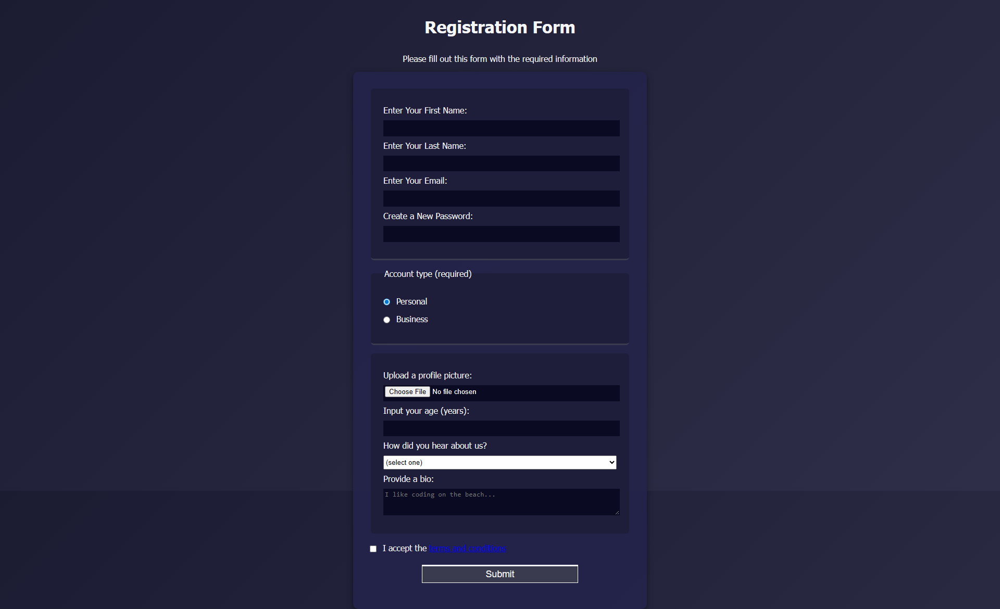

# Registration Form 📝  

A responsive **Registration Form** built with **HTML5** and **CSS3**. This project is part of my front-end development practice, inspired by the FreeCodeCamp curriculum.  

🔗 [Live Demo](https://josephvyse.github.io/frontend-exercises/04-registration-form/)  

---

## 📌 Features
- Input fields for **name, email, password, and age** with HTML5 validation.  
- **Radio buttons** for account type selection (personal or business).  
- **File upload** option for profile picture.  
- **Select dropdown** for referral source.  
- **Textarea** for short bio input.  
- **Checkbox** for terms and conditions.  
- Styled with gradients, shadows, rounded corners, and responsive layout.  

---

## 🛠 Technologies Used
- HTML5 (forms, validation, input types)  
- CSS3 (flexible layout, gradients, shadows, borders, responsive design)  

---

## 📷 Screenshot
   

---

## 🎯 Lessons Learned
- How to use different **HTML form elements**: text, email, password, number, file, textarea, radio, checkbox, select.  
- Applying **HTML5 validation rules** (e.g., required fields, min/max, regex pattern).  
- Styling forms with **gradients, shadows, border-radius, and spacing** for a modern look.  
- Organizing form sections with `<fieldset>` and `<legend>` for better semantics.  

---
