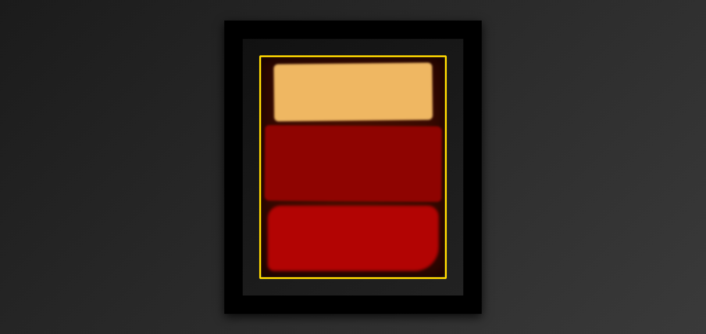

# Rothko Painting 🎨  

A creative **HTML & CSS project** that simulates a Rothko-style abstract painting using gradients, shadows, blur effects, and styled divs.  

🔗 [Live Demo](https://josephvyse.github.io/frontend-exercises/05-rothko-painting/)  

---

## 📌 Features
- **Framed canvas design** with inner golden border.  
- **Radial and linear gradients** for realistic painting and frame textures.  
- Abstract layered blocks styled with **blur, shadows, and rotations** for a painterly effect.  
- Centered layout with responsive scaling.  
- No images used — painting created purely with **CSS styling**.  

---

## 🛠 Technologies Used
- HTML5  
- CSS3 (gradients, blur filters, box shadows, transforms, pseudo-elements)  

---

## 📷 Screenshot
  

---

## 🎯 Lessons Learned
- How to use **CSS filters** like `blur()` for artistic effects.  
- Applying **box shadows** and **gradients** to simulate textures.  
- Using **pseudo-elements** (`::after`) for decorative borders.  
- Structuring abstract art with simple `
` blocks styled creatively.  

---
