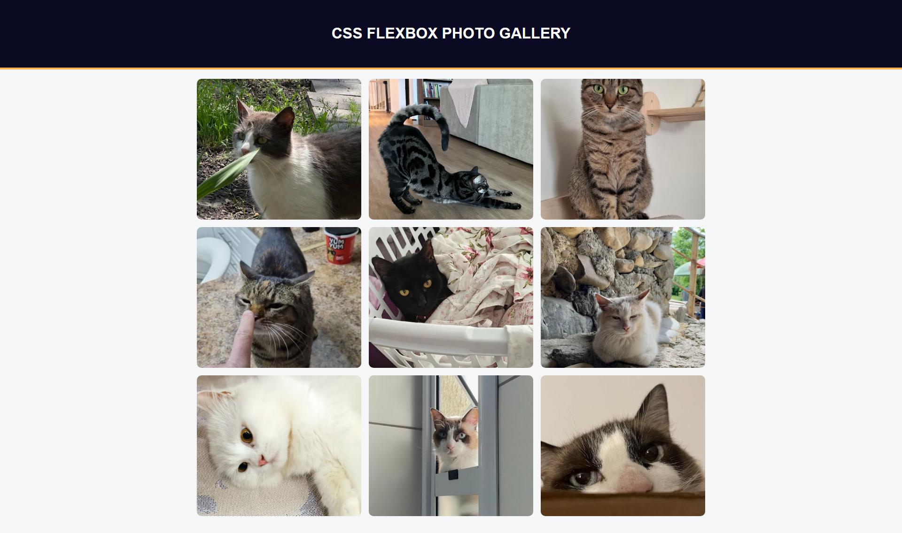

# CSS Flexbox Photo Gallery 📸  

A responsive **Photo Gallery** built with **HTML5** and **CSS3 Flexbox**. This project is part of my front-end development practice, inspired by the FreeCodeCamp curriculum.  

🔗 [Live Demo](https://josephvyse.github.io/frontend-exercises/06-photo-gallery/)  

---

## 📌 Features
- Responsive photo gallery layout using **Flexbox**.  
- **Flex-wrap** and **gap** for even spacing between photos.  
- **Object-fit: cover** to keep images proportional inside fixed containers.  
- Styled header with uppercase text and border highlight.  
- Rounded corners on all images for a polished look.  

---

## 🛠 Technologies Used
- HTML5  
- CSS3 (Flexbox, object-fit, responsive design)  

---

## 📷 Screenshot
  

---

## 🎯 Lessons Learned
- How to build a **flexbox grid layout** that adapts to screen sizes.  
- Controlling image display with **object-fit** for consistency.  
- Using **flex-wrap** and **gap** to control spacing in flexible layouts.  
- Applying clean UI touches like **borders, colors, and rounded corners**.  

---
