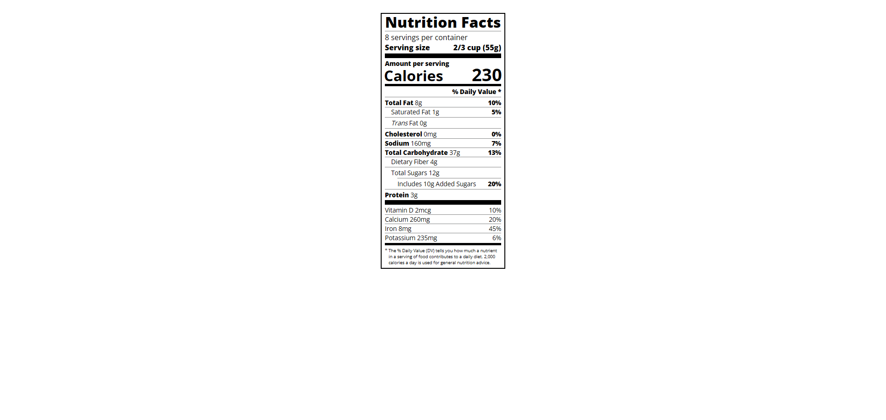

# Nutrition Label 🥗  

A recreation of a **Nutrition Facts label** built entirely with **HTML5** and **CSS3**. This project is part of my front-end development practice, inspired by the FreeCodeCamp curriculum.  

🔗 [Live Demo](https://josephvyse.github.io/frontend-exercises/07-nutrition-label/)  

---

## 📌 Features
- Structured HTML with semantic elements for text and layout.  
- Custom **dividers and bold text** to mimic a real nutrition label.  
- **Flexbox layout** for aligning calories, nutrients, and daily values.  
- Responsive design that maintains proportions across screen sizes.  
- Styled with **borders, spacing, and indentation** for authenticity.  

---

## 🛠 Technologies Used
- HTML5  
- CSS3 (Flexbox, font styling, dividers, spacing)  

---

## 📷 Screenshot
  

---

## 🎯 Lessons Learned
- How to structure a design with **nested elements and flexbox**.  
- Using **font weights, sizes, and spacing** to replicate real-world designs.  
- Creating **custom dividers and indentations** with CSS.  
- Understanding how small details in CSS (e.g., letter-spacing, margins) make a big difference in UI accuracy.  

---
