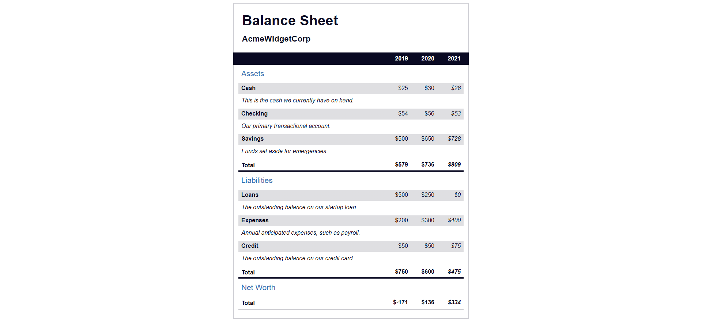

# Balance Sheet 📊  

A visually accurate and accessible **balance sheet layout** built with **HTML5** and **CSS3**.  
This project is part of my front-end development practice inspired by the FreeCodeCamp curriculum.  

🔗 [Live Demo](https://josephvyse.github.io/frontend-exercises/09-balance-sheet/)  

---

## 📌 Features  
- Fully structured using **semantic HTML elements** and **accessible markup**.  
- **Screen-reader–only text** for improved accessibility and usability.  
- Uses **CSS sticky positioning** for fixed year headers during scroll.  
- Clean **table-based layout** for Assets, Liabilities, and Net Worth.  
- Consistent spacing, borders, and typography for readability and hierarchy.  
- Subtle hover effects for interactive highlighting.  

---

## 🛠 Technologies Used  
- HTML5  
- CSS3 (Flexbox, position sticky, pseudo-classes, responsive structure)  

---

## 📷 Screenshot  
  

---

## 🎯 Lessons Learned  
- Structuring financial data with **semantic and accessible tables**.  
- Using **absolute positioning** for captions and sticky elements.  
- Managing **layout alignment** with `calc()` and fixed column widths.  
- Implementing **.sr-only** classes for screen-reader–friendly content.  
- Enhancing design clarity with **gradients, borders, and spacing**.  

---
